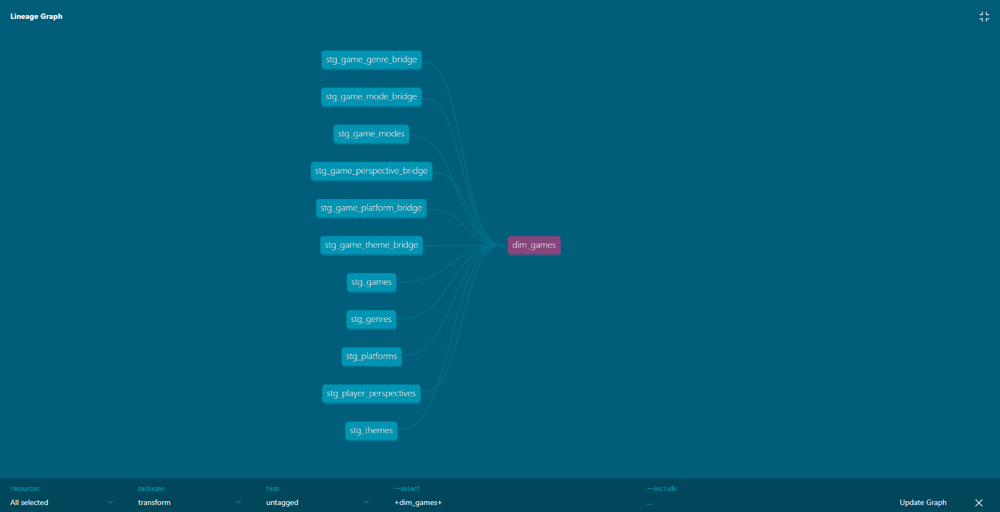
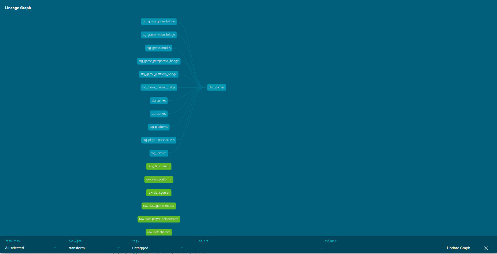
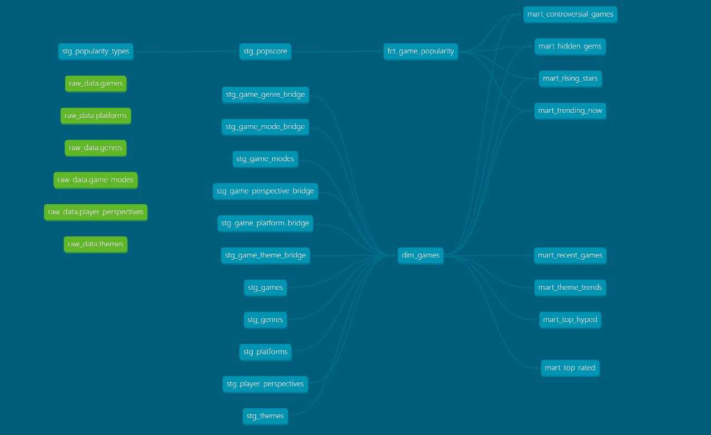

# 프로젝트 요약

**작고 빠른 게임 데이터 파이프라인**

[](https://www.python.org/downloads/)
[](https://github.com/astral-sh/uv)
[](https://www.getdbt.com/)

[](https://github.com/webplusangels/gameboy-pipeline/actions/workflows/ci.yml)
[](https://codecov.io/gh/webplusangels/gameboy-pipeline)

## 라이브 데모

파이프라인이 수집한 게임 데이터를 실시간으로 탐색해보세요.

[](https://gameboy-pipeline-f9xnvfsfs54eapgwteldez.streamlit.app/)

## 아키텍처 다이어그램

> 서버리스(Serverless)와 저비용을 목표로 설계된 모델입니다.


<details>

<summary>`dbt` 리니지 그래프</summary>

**2025.11.10 - ELT 구현 직후**



**2025.11.13 - 배포 모델**



**2025.12 - 대시보드 구성**



</details>

## 왜 만들었는가

> **문제:** 기존 [game-pricing-pipeline](https://github.com/webplusangels/game-pricing-pipeline)에서 경험한 유지보수의 어려움  
> **해결:** TDD와 타입 안정성을 바탕으로 한 현대적인 재설계

[game-pricing-pipeline](https://github.com/webplusangels/game-pricing-pipeline)은 인기 게임들의 정보와 특가 정보를 제공하고, 간단하지만 편리한 팀 파인드 서비스를 제공하는 프로젝트인 [WARA:B](https://github.com/100-hours-a-week/9-team-gudokjohayo-warab-be)(백엔드 레포)의 일부로, 운영을 위한 데이터 수집, 업데이트 등 프로젝트에 필요한 데이터 관련 작업을 자동화하기 위해 개발된 파이프라인 모듈입니다.

초기 개발에서 집중한 기능 완성과는 별개로, 실제 운영 과정에서는 다음과 같은 **문제점**들이 발견되었습니다.

- ❌ 코드의 가독성과 낮은 유지 보수성
- ❌ 긴 실행 시간 (배치 작업 최적화 부족)
- ❌ 테스트 안정성 부재 (트러블슈팅 시간 증가)

이 파이프라인은 다음과 같은 **목표**를 가지고 개발되었습니다.

- ✅ 하나의 안정적인 진실 공급원(IGDB API)
- ✅ 가볍고 현대적인 구조 (Interface 기반 설계)
- ✅ TDD 개발 방식 (RED-GREEN-REFACTOR)
- ✅ 타입 안정성 (mypy strict mode)
- ✅ 데이터 기반 점진적 성능 향상
- ✅ 체계적인 문서화

자세한 설명은 [프로젝트 개요 문서](./docs/01_Project.md)를 참고해주세요.

## 성능 요약

### 벤치마크 결과

| 항목                       | 이전 (game-pricing-pipeline) | 현재 (gameboy-pipeline) | 개선율            |
| -------------------------- | ---------------------------- | ----------------------- | ----------------- |
| **API 호출 방식**          | 동기 (순차)                  | 비동기 (병렬)           | **최대 6배 향상** |
| **게임 수집 (100개 기준)** | ~240초                       | ~0.14초                 | **1,700배**       |
| **테스트 커버리지**        | ~5%                          | 97%                     | **90%p 향상**     |
| **응답 성공률**            | 95%                          | 100%                    | **5%p 향상**      |
| **데이터 크기**            | JSON, CSV (15MB~)            | JSONL, parquet (~400MB) | **24배 증가**     |

### 비용 효율성

- **인프라 비용**: $0/월
- **S3 스토리지**: ~$0.03/월 (1GB 기준)
- **데이터 전송**: ~$0.05/월 (CloudFront 캐싱)
- **총 운영 비용**: **< $0.1/월**

### 주요 최적화 기법

1. **비동기 I/O**: `httpx` + `asyncio`로 API 대기 시간 최소화
2. **증분 적재**: 변경된 데이터만 수집 (Full Refresh 대비 95% 시간 절약)
3. **CloudFront CDN**: S3 DTO 비용 90% 절감
4. **컬럼 기반 압축**: Parquet Snappy 압축으로 저장/전송 최적화

자세한 분석은 [성능 측정 문서](./docs/04_Performance.md)를 참고해주세요.

## 기술 스택

### 데이터 파이프라인

| 계층              | 기술                | 역할                            |
| ----------------- | ------------------- | ------------------------------- |
| **Extract**       | `httpx` + `asyncio` | IGDB API 비동기 데이터 수집     |
| **Load**          | `aioboto3` + S3     | JSONL 형식으로 원본 데이터 저장 |
| **Transform**     | `dbt` + `DuckDB`    | SQL 기반 데이터 변환 및 모델링  |
| **Orchestration** | GitHub Actions      | 일일 스케줄링 (매일 4시 KST)    |

### 인프라

- **스토리지**: AWS S3 (Data Lake)
- **CDN**: CloudFront (DTO 비용 90% 절감)
- **분석 DB**: DuckDB (서버리스, 비용 $0)
- **시각화**: Streamlit Community Cloud

### 개발 도구

- **언어**: Python 3.11
- **패키지 관리**: uv (Ruff 툴체인)
- **테스팅**: pytest + pytest-asyncio + pytest-cov
- **타입 체킹**: mypy (strict mode)
- **린팅**: Ruff (linter + formatter)
- **CI/CD**: GitHub Actions

자세한 선택 배경은 [기술 스택 문서](./docs/02_Tech_Stacks.md)를 참고해주세요.

## Quick Start

### 사전 요구사항

- Python 3.11 이상
- [uv](https://github.com/astral-sh/uv) (권장) 또는 pip
- AWS 계정 (프로덕션 배포 시)
- IGDB API 키 ([발급 방법](https://api-docs.igdb.com/#account-creation))

<details>

<summary><b>Quick Start 펼쳐보기</b></summary>

### 1. 설치

```bash
# 저장소 클론
git clone https://github.com/webplusangels/gameboy-pipeline.git
cd gameboy-pipeline

# 의존성 설치 (uv 사용)
uv sync --extra dev

# 또는 pip 사용
pip install -r requirements.txt
```

### 2. 환경 설정

```bash
# .env 파일 생성
cp .env.example .env

# 필수 환경 변수 입력
# IGDB_CLIENT_ID=your_client_id
# IGDB_STATIC_TOKEN=your_token
# AWS_ACCESS_KEY_ID=your_key (옵션)
# AWS_SECRET_ACCESS_KEY=your_secret (옵션)
```

### 3. 로컬 실행

**테스트 실행**:

```bash
uv run pytest tests/ -v
```

**파이프라인 실행 (로컬 모드 X)**:

```bash
uv run scripts/run_pipeline.py
```

**dbt 변환 실행**:

```bash
cd transform
uv run dbt run --target dev_local_tdd
uv run dbt test  # 데이터 품질 검증
```

### 4. 대시보드 확인

```bash
# Streamlit 로컬 실행
uv run streamlit run dashboard/app.py
```

브라우저에서 `http://localhost:8501` 접속

### 트러블슈팅

**Q: IGDB API 401 Unauthorized 오류**

- A: `.env` 파일의 `IGDB_CLIENT_ID`와 `IGDB_STATIC_TOKEN` 확인
- A: 토큰 만료 시 [재발급](https://api-docs.igdb.com/#authentication) 필요

**Q: dbt 실행 시 파일을 찾을 수 없음**

- A: 로컬 모드에서는 `dev_local_tdd` 타겟 사용 (`dbt run --target dev_local_tdd`)
- A: S3 경로 대신 로컬 파일 시스템 사용

**Q: 테스트 실패**

- A: Mock 데이터 확인: `tests/test_data/` 디렉토리
- A: 의존성 재설치: `uv sync --extra dev`

</details>

더 많은 정보는 [개발 가이드](./CONTRIBUTING.md)를 참조하세요.

## 링크

- [01. 프로젝트와 구조](./docs/01_Project.md)
- [02. 기술 스택](./docs/02_Tech_Stacks.md)
- [03. 학습 기록](./docs/03_Learning_Log.md)
- [04. 성능 측정](./docs/04_Performance.md)
- [05. 데이터 모델](./docs/05_Data_Model.md)
- [개발 방식](./CONTRIBUTING.md)

## 타임라인

- **2025.11.01**: 프로젝트 시작
- **2025.11.10**: ELT 파이프라인 완성 (E2E 테스트 통과)
- **2025.11.13**: [Streamlit 대시보드](https://gameboy-pipeline-f9xnvfsfs54eapgwteldez.streamlit.app/) 배포
- **2025.11.24**: 문서화 완료
- **2026.12**: Phase 1 완료
