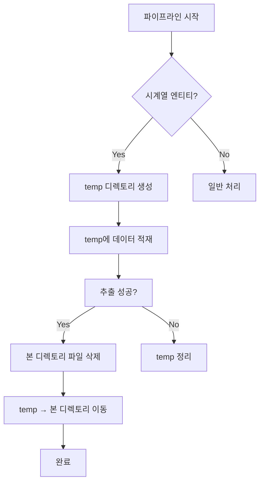

# 06. 리팩토링

이 문서는 프로젝트에서 진행한 리팩토링 작업에 대해 설명합니다.

## 📋 목차

1. 코드 분리 및 벤치마크 측정
2. 동시성 구현
3. S3 태그 정책 구체화
4. 대시보드 개선
5. Pop Score 추가와 멱등성 문제

## 5. Pop Score 추가와 멱등성 문제

### Pop Score란?

Pop Score는 IGDB에서 제공하고 있는 일종의 `인기도 점수`입니다. 산출되는 정확한 수학적 공식은 스팸이나 어뷰징을 방지하기 위해 비공개로 유지되고 있지만, API 문서와 해당 데이터베이스를 소유하고 있는 Twitch와의 연동 방식을 통해 어떤 요소들이 가중치로 작용하는지는 대충 파악이 가능합니다.

추정하는 주요 구성 요소로는 다음과 같습니다.

- IGDB 페이지 조회수: 웹사이트에서 게임 페이지가 얼마나 많이 조회되는지
- 유저 인터랙션: 유저가 게임과 상호작용 즉 리스트와 컬렉션, 레이팅 같은 행위를 했을 때
- 검색 빈도: 웹사이트에서 검색이 얼마나 되었는지
- Twitch 백엔드: 스트리머가 플레이하는 게임으로 설정될 때의 데이터와 시청자 트래픽 데이터
- 서드파티 조회: Playnite와 Lutris 같은 게임 런처들의 API 조회수

### 왜 Pop Score와 연동하는지?

처음엔 프로젝트의 처음처럼 WaraB와 같이 게임 가격 데이터를 연동하는 것이 좋다고 생각했습니다. 하지만 실무에서의 데이터는 B2C 소비자 위주의 데이터보다는 내부 비즈니스 결정, 즉 기획과 마케팅 관점에서 수집하고 사용-분석하는 경우가 많다고 생각했습니다. 실제로 IGDB에는 단순 정적인 데이터 뿐만 아니라 Hype(기대감)를 비롯해 비슷한 게임과 같은 의사 결정에 도움이 되는 데이터들을 풍부하게 포함하고 있습니다.

그 중에서 Pop Score는 거대한 생태계인 Twitch와 연동되어 세계에서 가장 큰 게임 데이터베이스로서 유용하게 사용될 수 있는 데이터로, IGDB에서 직접 개발하여 제공하고 있습니다. 대표적으로 Steam 리뷰를 포함해서 실제 플레이 지표와도 큰 연관이 있으며, 이는 제 데이터 파이프라인과 아주 잘 어울릴 수 있는 주제라고 생각하였습니다.

또 하나 중요한 점은 현재 매일 수집 중인 데이터는 단순 게임 데이터로서 데이터베이스의 성격이 강했고, 파이프라인이라는 장점을 온전히 쓴다고 보기에는 어려웠습니다. 하지만 PopScore는 시계열 데이터로 24시간을 기준으로 매일 전체 스냅샷을 수집해야 하고, 과거 데이터를 보존해야 하는 요구 사항이 존재합니다. 이 때문에 (일별)데이터 파티셔닝이 데이터 레이크에서 어떤 역할을 하는지와 이의 효과 등을 눈으로 확인할 수 있는 기회가 될 것입니다.

###

---

## 📝 문제 해결 과정 서술 구조

### **1. 제목 및 메타데이터**

```markdown
# PopScore 엔티티 멱등성 보장

- **날짜**: 2025-12-17
- **작성자**: [이름]
- **관련 이슈**: #123 (있다면)
- **상태**: ✅ 완료
```

### **2. 문제 정의 (Problem Statement)**

```markdown
## 🚨 문제

### 배경

- PopScore는 시계열 데이터로 매일 전체 스냅샷을 수집
- 과거 데이터를 보존해야 하는 요구사항 존재

### 발견된 문제

같은 날짜에 파이프라인을 여러 번 실행하면 **중복 데이터**가 발생:

\`\`\`

# 2025-01-15 첫 실행

s3://bucket/raw/popscore/dt=2025-01-15/
├── batch-0-uuid1.jsonl [final]
└── batch-1-uuid2.jsonl [final]

# 2025-01-15 재실행 → 중복 발생! ❌

s3://bucket/raw/popscore/dt=2025-01-15/
├── batch-0-uuid1.jsonl [final] ← 기존
├── batch-1-uuid2.jsonl [final] ← 기존
├── batch-0-uuid3.jsonl [final] ← 중복!
└── batch-1-uuid4.jsonl [final] ← 중복!
\`\`\`

### 영향

- 데이터 중복으로 인한 스토리지 비용 증가
- 다운스트림(DBT) 변환 시 중복 레코드 처리 필요
- **멱등성(Idempotency) 원칙 위반**
```

### **3. 원인 분석 (Root Cause Analysis)**

```markdown
## 🔍 원인 분석

### 현재 아키텍처

1. **UUID 기반 파일명**: `batch-{count}-{uuid}.jsonl`

   - 재실행 시 새로운 UUID 생성 → 파일명 충돌 없음
   - 기존 파일과 새 파일이 공존

2. **시계열 데이터 특성**
   - 일반 엔티티: `outdated` 태그로 구버전 표시
   - PopScore: 과거 데이터 보존 위해 `outdated` 처리 제외
   - **결과**: 같은 날짜 재실행 시 무한 누적

### 근본 원인

**파일명 충돌 방지(UUID) + outdated 미적용 = 멱등성 보장 불가**
```

### **4. 해결 방안 검토 (Solution Exploration)**

```markdown
## 💡 해결 방안 검토

### Option 1: 같은 날짜 파티션만 outdated 처리

**동작**:

- 같은 `dt_partition` 내의 기존 `final` 파일을 `outdated`로 변경
- 다른 날짜는 그대로 유지

**장점**:

- ✅ 과거 데이터 완전 보존
- ✅ 멱등성 보장

**단점**:

- ⚠️ 구현 복잡도: 날짜별 태그 조회 필요
- ⚠️ 성능: S3 태그 조회 오버헤드
- ⚠️ 코드 복잡성: 특수 케이스 분기 추가

---

### Option 2: 실행 시간 기반 서브 파티션

**동작**:
\`\`\`
s3://bucket/raw/popscore/dt=2025-01-15/run_time=10:00:00/
s3://bucket/raw/popscore/dt=2025-01-15/run_time=14:00:00/
\`\`\`

**장점**:

- ✅ 자동 분리
- ✅ 재실행 이력 추적 가능

**단점**:

- ⚠️ 다운스트림 복잡도 증가
- ⚠️ "최신 데이터" 선택 로직 필요

---

### **Option 3: UUID 제거 + 덮어쓰기** ⭐ (선택)

**동작**:

- PopScore만 고정 파일명 사용: `batch-0.jsonl`
- 같은 날짜 재실행 시 덮어쓰기

**장점**:

- ✅ 간단한 구현
- ✅ 완벽한 멱등성
- ✅ 스토리지 효율
- ✅ outdated 태그 불필요

**단점**:

- ⚠️ 배치 수 변동 시 orphan 파일 가능

---

### **Option 3+ (최종 선택): UUID 제거 + 원자적 교체**

**개선점**:

1. temp 디렉토리에 먼저 적재
2. 성공 시 기존 파일 삭제 → temp 이동
3. 실패 시 기존 데이터 보존

**장점**:

- ✅ Option 3의 모든 장점
- ✅ **원자성(Atomicity)** 보장
- ✅ 배치 수 변동 안전
```

### **5. 구현 세부사항 (Implementation Details)**

````markdown
## 🛠️ 구현

### 아키텍처 변경

#### 1. BatchProcessor - 조건부 UUID 사용

```python

# src/pipeline/batch_processor.py

def \_generate_batch_key(s3_path_prefix: str, batch_count: int, entity_name: str):
if entity_name in TIME_SERIES_ENTITIES:
return f"{s3_path_prefix}/batch-{batch_count}.jsonl" # UUID 제거
else:
return f"{s3_path_prefix}/batch-{batch_count}-{uuid.uuid4()}.jsonl"
```
````

#### 2. S3 Operations - 파일 관리

```python

# src/pipeline/s3_ops.py

async def delete_files_in_partition(...) # 파티션 내 파일 삭제
async def move_files_atomically(...) # temp → 본 디렉토리 이동
```

#### 3. Orchestrator - 원자적 교체 흐름

```python
if entity*name in TIME_SERIES_ENTITIES: # 1. temp 디렉토리에 적재
temp_partition = f"{dt_partition}/\_temp*{uuid}"

    # 2. 기존 파일 삭제
    delete_files_in_partition(dest_partition)

    # 3. temp → 본 디렉토리 이동
    move_files_atomically(temp_partition, dest_partition)

```

### 실행 흐름



### **6. 검증 (Validation)**

```markdown
## ✅ 검증

### 테스트 커버리지

- ✅ 14개 테스트 모두 통과
- ✅ Orchestrator: 99% 커버리지
- ✅ BatchProcessor: 46% → UUID 로직 검증 완료

### 주요 테스트 케이스

1. **UUID 조건부 사용**

   - PopScore: `batch-0.jsonl` (UUID 없음) ✅
   - Games: `batch-0-{uuid}.jsonl` ✅

2. **멱등성**

   - 같은 날짜 재실행 → 파일 수 동일 ✅
   - 배치 수 변동 → orphan 없음 ✅

3. **원자성**

   - temp 디렉토리 사용 ✅
   - 실패 시 기존 데이터 보존 ✅

4. **과거 데이터 보존**
   - 다른 날짜 파티션 영향 없음 ✅
```

### **7. 결과 및 영향 (Results & Impact)**

```markdown
## 📊 결과

### 달성 목표

- ✅ **멱등성 보장**: 같은 입력 → 같은 결과
- ✅ **원자성 보장**: All or Nothing
- ✅ **과거 데이터 보존**: 시계열 특성 유지
- ✅ **스토리지 효율**: 중복 제거

### Before / After

| 항목             | Before      | After     |
| ---------------- | ----------- | --------- |
| 재실행 시 중복   | ❌ 발생     | ✅ 없음   |
| 파일 수 (재실행) | 2x, 3x 증가 | 동일 유지 |
| 원자성           | ❌ 없음     | ✅ 보장   |
| 구현 복잡도      | 중간        | 중간      |

### 향후 고려사항

- [ ] 실제 프로덕션 환경 모니터링
- [ ] temp 디렉토리 정리 로직 (실패 시)
- [ ] CloudWatch 메트릭 추가
```
